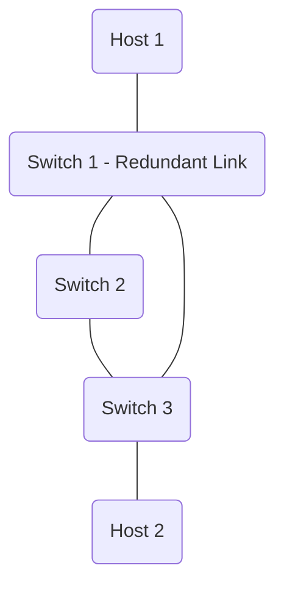

# SDN Link Failure Detection and Recovery

This project demonstrates link failure detection and automated recovery within a Software-Defined Network (SDN) utilizing **Mininet** and the **Ryu OpenFlow Controller**.

The goal of this project is to create a multi-path triangle network topology, observe normal flow generation, proactively tear down an active link, and visualize the controller dynamically finding an alternate path, unblocking ports, and redirecting traffic seamlessly.

## Network Topology
- **Switches**: 3 OpenvSwitches (S1, S2, S3) arranged in a Triangle to form redundant paths.
- **Hosts**: 2 Hosts (H1 connected to S1, H2 connected to S3).
- **Controller**: Remote Ryu Controller supporting OpenFlow 1.3.



## Features
- **Dynamic MAC Learning**: Reactively builds paths based on incoming packets.
- **Loop Prevention**: Implements Spanning Tree Protocol (STP) using Ryu's native `stplib` to safely disable redundant loop links during network discovery.
- **Self-Healing / Fallback Recovery**: Actively listens for `EventTopologyChange` port changes (link down). Upon failure detection, it quickly clears OpenFlow rule caches across the network, forcing re-transmission of packets over the backup routes without permanent connection loss.

## Environment Prerequisites (Ubuntu 22.xx)

To run this on Windows, you must use an Ubuntu Virtual Machine, WSL2, or a Docker container.

1. **Update and Install Mininet**:
    ```bash
    sudo apt update
    sudo apt install mininet
    ```

2. **Install Python pip & Ryu**:
    Ryu typically requires older versions of some dependencies. It's often easiest to install via `pip`:
    ```bash
    sudo apt install python3-pip
    sudo pip3 install ryu
    ```

3. **Verify OpenvSwitch**:
    ```bash
    sudo systemctl enable openvswitch-switch
    sudo systemctl start openvswitch-switch
    ```

## Execution Instructions

You will need two separate terminal windows (or tabs) within your Linux environment.

**Terminal 1 (Ryu Controller):**
Start the Controller application.
```bash
cd /path/to/folder
ryu-manager controller.py
```

**Terminal 2 (Mininet Setup):**
Create the network layout and connect it to the listening Ryu controller.
```bash
cd /path/to/folder
sudo python3 topology.py
```

### Verifying Normal Operation vs. Failure

In the Mininet CLI (`mininet>`), you can simulate the link failure to demonstrate the project:

1. **Initial testing:** Let the switches learn routes and ensure everything works:
   ```text
   mininet> pingall
   ```

2. **Start a continuous ping:**
    Open an Xterm for H1 and H2, or do this inline:
   ```text
   mininet> h1 ping h2
   ```

3. **Simulate the Link Failure:**
   While the ping is running, bring down the primary link (e.g., between S1 and S3) by typing:
   ```text
   mininet> link s1 s3 down
   ```

   **Watch the outputs**:
   - The pings will likely drop for a moment.
   - The Controller (Terminal 1) will output: `Topology Change Detected. Flushing flow tables...`
   - Traffic routes through `s2` instead, and pings will resume!

4. **Performance verification (Optional)**:
   ```text
   mininet> h2 iperf -s &
   mininet> h1 iperf -c h2
   ```

## Troubleshooting
- If Mininet is unresponsive or links remain orphaned, always clear the mininet state using:
  ```bash
  sudo mn -c
  ```
- If Ryu fails to start due to `eventlet` or `werkzeug` errors, you may need to downgrade dependencies (`sudo pip3 install eventlet==0.30.2 werkzeug==2.0.3`).
